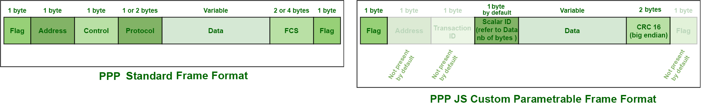

# PPPJS-protocol
Description of the PPPJS custom protocol, implementing a mix of "[Point to Point Protocol](https://en.wikipedia.org/wiki/Point-to-Point_Protocol)" like frames and the famous [JSON](https://fr.wikipedia.org/wiki/JavaScript_Object_Notation) notation for versatile transfers over UARTS lines and other serial data streams.

A transaction starts on a free line, with the reception of one byte being of one out of three possible values :

- a start flag for a Json transaction, by default **0x7B** : **{**  an open bracket describing the start of a Json object description according to the standard.

- a start flag for a scalar high throughput data transaction in binary format, by default **0x23** : **#**

- a start flag for a quick acknowledge in binary format, by default **0x40** : **@**

	

The following of aggregation of bytes inside the sequence depends on each type :

- for **Json**, the protocol supports nested objects, and thus, the line stops after a 0x7C : } closing bracket is encountered while the level of nested objects is back to the outermost value.

- for **Scalar** binary high throughput data, the second byte is expected to represent the id of the value being exchanged, which must be known and associated with a type (hence a number of bytes) by all the agents in the transaction.

	The next bytes are representing the actual content of the value, and the number of bytes expected depends on the ID for which all agents agreed upon. (4 for a single precision float or a 32 bits integer for example)

	The final last two bytes are storing the [Cyclic Redundancy Check](https://fr.wikipedia.org/wiki/Contr%C3%B4le_de_redondance_cyclique) over 16bits - with CCITT-FALSE algorithm (Initialization = 0xFFFF, Check = 0x8000,  Polynomic = 0x1021), in big-endian order. 

	This CRC16 is calculated by the sending agent from the X-bytes of the data transferred after the ID byte. It can be recalculated from those bytes by the receiving agent and compared with the received CRC value to see if some bits were corrupted during transfer.

	The following schematic summarize the scalar PPPJS frame format.

	

- for a **Fast acknowledge**, the byte just next to the start flag contains the value of this acknowledge. 

	- VALID: **0x41** = a 
	
	- INVALID : **0x6E** = N  
	
	- OVERFLOW : **0x4F** = O 
	
	- LINE_READY : **0x72** = r
	
		

<u>Acknowledge usage rationale :</u>

The acknowledge should serve as a way to free the line after a successful transaction and only in that way to avoid putting the line on wait while the consumer actually verify the data. It should not be aware of the fact that the data is actually useful for the consumer behind it. As the protocol offers Json rich capabilities, one could implement an automatic response after a successful and acknowledged transaction, to notify the emitter agent that the data transmitted couldn't be used (e.g.. an unexpected key, or an invalid data value)

**An INVALID -Acknowledge should be emitted :**

- When a Json object deserialization fails
- When a received CRC doesn't match it's calculated value

**An INVALID -Acknowledge should not be emitted :**

- When a data transferred with valid integrity cannot be used. A high level user dependent answer can be implemented to programmatically tackle these edge cases. This is not the role of the mid-low level protocol routine.
- When bytes are received without a start byte initiating a Json, Binary Scalar or Fast Acknowledge. The data must be trashed until a valid starting byte is encountered 
- When an line was partially received (timed out after start). In that case the data can just be trashed.
- When a line start is incorrect. An Overflow Acknowledge must be sent to put the line in a known state and all bytes currently in the UART buffer should be trashed.

**An OVERFLOW should be emitted only**

- when a line started with incorrect start flag, to notify all bytes from now will be ignored until the UART has been cleared and the line is ready to restart with fresh data and low risk of frame shift.

**A LINE_READY should be emitted only**

- when a line cleared it's UART buffer and didn't received a new byte for a short amount of time, to notify the sending agent on the other side can begin communicating again.

A frozen line **timeout** is required to ensure that the communication can recover from a TX and RX simultaneous OVERFLOW Acknowledge emitted by both agents in case it happens. After this timeout, without sending data for a given amount of time after an Overflow-Acknowledge has been received, if no Line-Ready-Acknowledge has been received, the half duplex line is put back into service by the sending agent.

2021 - Timothé Jost Mousseau